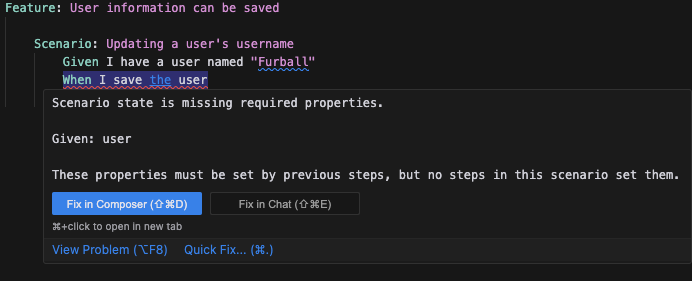

It's normal to need to pass state between steps while writing a scenario. As an example, let's say we're writing a step that gets a user by their email address.

```gherkin
Feature: User Management

  Scenario: Get user by email
    Given I have a user with the email "test@example.com"
    When I get the user by email
    Then the user should be found
    And the user's email should be "test@example.com"
```

In this scenario, we need to be able to pass the user's email address between the `Given` and `When` steps. We also need to pass the user found in the `When` step to the `Then` steps.

Dependencies allow your steps to declare what they need to function, and let Step Forge enforce those at both compile and runtime.

## Defining dependencies

Dependencies are defined as part of your step's builder function. It can be optionally chained off of the `statement` or `parsers` functions. Let's define the `When I get the user by email` step shown above.

```typescript
interface GivenState {
  email: `${string}@${string}.${string}`;
}

const getUserByEmailStep = whenBuilder<GivenState, WhenState>()
  .statement("I get the user by email")
  // The step will now fail at runtime if the email is not provided by a Given step
  .dependencies({ given: { email: required } })
  // given.email is now typed as `${string}@${string}.${string}` based on the GivenState type
  .step(({ given: { email } }) => {
    // ...
  });
```

## Compile time dependency checking

If you are using the Step Forge VS Code extension, you will see compile time errors in your editor if you add a step to your Gherkin scenario that has an unmet dependency. It will also suggest steps that can fulfill the dependency through the `Quick Fix` action.


