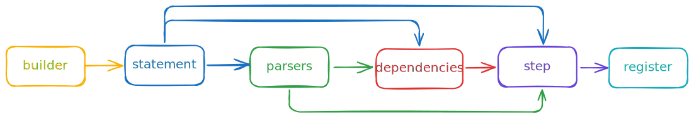

The `whenBuilder` is used to define `When` steps. It uses a builder pattern to define the different parts of the step. The chain is depicted below and we'll cover each part in detail below.



## Properties

### whenBuilder<GivenState, WhenState>

In order to start building a when step, use the `whenBuilder` function. This function takes two generic parameters:

- `GivenState`: the type of your defined Given state
- `WhenState`: the type of your defined When state

If you aren't sure how to define these states, check out the [setting up Cucumber](/docs/guides/setting-up-cucumber) guide.

```typescript
const whenBuilder = whenBuilder<GivenState, WhenState>();
```

> **Note**: In Cucumber Given, When, and Then steps are all interchangeable, however, in Step Forge they are not. If you are going to have a step be used in the When section, it must be defined using the `whenBuilder`.

Chains to:

- [statement](#whenBuilderstatement)

### whenBuilder.statement

```typescript
statement(string);
statement((...args: any[]) => string);
```

The `statement` property defines the text that will match to your Gherkin files. It can take either a string or a function that returns a string. This is required for your step to function.

```typescript
// Example using a string
whenBuilder<GivenState, WhenState>().statement("When I withdraw 100 dollars");

// Example using a statement variables
whenBuilder<GivenState, WhenState>().statement(
  (amount: number) => `When I withdraw ${amount} dollars`
);
```

> **Note**: If you are using statement variables that aren't strings, it's important to use parsers to ensure you get the correct type.

Chains to:

- [parsers](#whenBuilderparsers) (optional)
- [dependencies](#whenBuilderdependencies) (optional)
- [step](#whenBuilderstep-required)

### whenBuilder.parsers

```typescript
parsers(parsers: Parser<any>[])
```

Cucumber by default passes in all statement variables as strings. Parsers allow you to convert those strings into strongly typed values in your step definition. Step Forge comes with built in parsers for most common primitive types, but you can also create your own. See the [parsers](/docs/reference/parsers) documentation for more information.

```typescript
// Number example
whenBuilder<GivenState, WhenState>()
  .statement((amount: number) => `When I withdraw ${amount} dollars`)
  .parsers([numberParser]);

// Multiple types example
whenBuilder<GivenState, WhenState>()
  .statement(
    (account: string, amount: number) =>
      `When I withdraw ${amount} dollars from ${account}`
  )
  .parsers([stringParser, numberParser]);
```

Chains to:

- [dependencies](#whenBuilderdependencies) (optional)
- [step](#whenBuilderstep-required)

### whenBuilder.dependencies

```typescript
dependencies(state: { given: { [key: string]: 'required' | 'optional' }, when: { [key: string]: 'required' | 'optional' } })
```

Dependencies allow you to inject values from the shared scenario state into your step function. The following rules apply to dependencies:

- In When steps, dependencies can be from both the `Given` and `When` state
- Dependencies can only be added on keys in the respective state types
- Required dependencies will cause the step to fail if the value is not found at runtime
- Optional dependencies will not cause the step to fail if the value is not found at runtime
- Optional dependencies are typed as possibly undefined values to the `step` function

```typescript
// Required dependency example
whenBuilder<GivenState, WhenState>().dependencies({
  given: {
    account: "required",
  },
  when: {
    transaction: "required",
  },
});

// Optional dependency example
whenBuilder<GivenState, WhenState>().dependencies({
  given: {
    account: "optional",
  },
  when: {
    transaction: "optional",
  },
});
```

Chains to:

- [step](#whenBuilderstep)

### whenBuilder.step

```typescript
step(step: ({ variables: V, given: G, when: W }) => Partial<WhenState>);
```

The `step` property defines the function that will be called when the step is matched. It has the most complicated behavior of all the builder functions, so we'll break down each part in detail below.

Chains to:

- [register](#whenBuilderregister)

#### Variables (V)

The `variables` parameter is an array containing the exact variables defined in the `statement` function or none if the `statement` function takes no arguments. Additionally, the types of each element in the array will be the output type of their corresponding parser if one was provided, otherwise it will be `string`. Attempting to depend on too many variables, or use it as an incompatible type with result in a TypeScript error.

##### No variables example

When no variables are defined in the `statement` function, the `variables` array will be typed as an empty array. It is not required to destructure the `variables` parameter in this case, but attempting to access it will result in a TypeScript error.

```typescript
whenBuilder<GivenState, WhenState>()
  .statement(`When I submit my order`)
  .step(({ variables: [] }) => {
    return {
      orderSubmitted: true,
    };
  });
```

##### Number example

```typescript
whenBuilder<GivenState, WhenState>()
  .statement((amount: number) => `When I withdraw ${amount} dollars`)
  .parsers([numberParser])
  // The type of amount will be number, due to the numberParser
  // The length of the variables array will be typed as strictly 1 due to the statement function only taking a single argument
  .step(({ variables: [amount] }) => {
    return {
      withdrawal: {
        amount,
      },
    };
  });
```

##### Multiple variables example

```typescript
whenBuilder<GivenState, WhenState>()
  .statement(
    (account: string, amount: number) =>
      `When I transfer ${amount} dollars to ${account}`
  )
  .parsers([stringParser, numberParser])
  // The type of account will be string, due to the stringParser
  // The type of amount will be number, due to the numberParser
  // The length of the variables array will be typed as strictly 2 due to the statement function taking two arguments
  .step(({ variables: [account, amount] }) => {
    return {
      transfer: {
        toAccount: account,
        amount,
      },
    };
  });
```

#### Given (G)

The `given` parameter is an object containing the keys from the `dependencies.given` object typed based on the `GivenState` type. If no dependencies are defined, the `given` object will be empty.

##### No dependencies example

When no dependencies are defined, the `given` object will be empty. Attempting to access any key will result in a TypeScript error.

```typescript
whenBuilder<GivenState, WhenState>()
  .dependencies({
    given: {},
  })
  .step(({ given }) => {
    return {
      processed: true,
    };
  });
```

##### Required dependency example

In this example we have a `GivenState` type that has an `account` property. Our step requires the `account` property to be defined to succeed, so we declare a required dependency on it. If the `account` property is not defined at runtime, the step will fail.

```typescript
interface GivenState {
  account: {
    balance: number;
  };
}

whenBuilder<GivenState, WhenState>()
  .dependencies({
    given: {
      account: "required",
    },
  })
  // given.account will be typed as { balance: number } since that is how its defined in the GivenState type
  // If given.account is not defined at runtime, the step will fail
  .step(({ given: { account } }) => {
    return {
      startingBalance: account.balance,
    };
  });
```

#### When (W)

The `when` parameter is an object containing the keys from the `dependencies.when` object typed based on the `WhenState` type. This is unique to When steps and allows them to build upon previous When steps in the scenario.

##### When dependency example

```typescript
interface WhenState {
  transaction: {
    id: string;
    amount: number;
  };
}

whenBuilder<GivenState, WhenState>()
  .dependencies({
    when: {
      transaction: "required",
    },
  })
  // when.transaction will be typed as { id: string, amount: number }
  .step(({ when: { transaction } }) => {
    return {
      processedTransaction: {
        ...transaction,
        status: "complete",
      },
    };
  });
```

##### Combined dependencies example

When steps can use both Given and When dependencies together:

```typescript
whenBuilder<GivenState, WhenState>()
  .dependencies({
    given: {
      account: "required",
    },
    when: {
      transaction: "required",
    },
  })
  .step(({ given: { account }, when: { transaction } }) => {
    return {
      result: {
        accountId: account.id,
        transactionId: transaction.id,
        status: "processed",
      },
    };
  });
```

#### Return Value

The value returned from the `step` function will be merged into the `When` state of the current scenario.

```typescript
whenBuilder<GivenState, WhenState>()
  .statement(`When I process the payment`)
  .step(() => {
    return {
      payment: {
        status: "processed",
        timestamp: new Date(),
      },
    };
  });
```

In this example, the `payment` property will be merged into the `When` state of the current scenario. This state will be available to any subsequent When or Then steps in the scenario, but not to Given steps.

### whenBuilder.register

```typescript
register();
```

The `register` function registers this step with Cucumber so that it will understand how to execute it. This is not required when using the Step Forge runner, but is required when using Cucumber's native runner.
